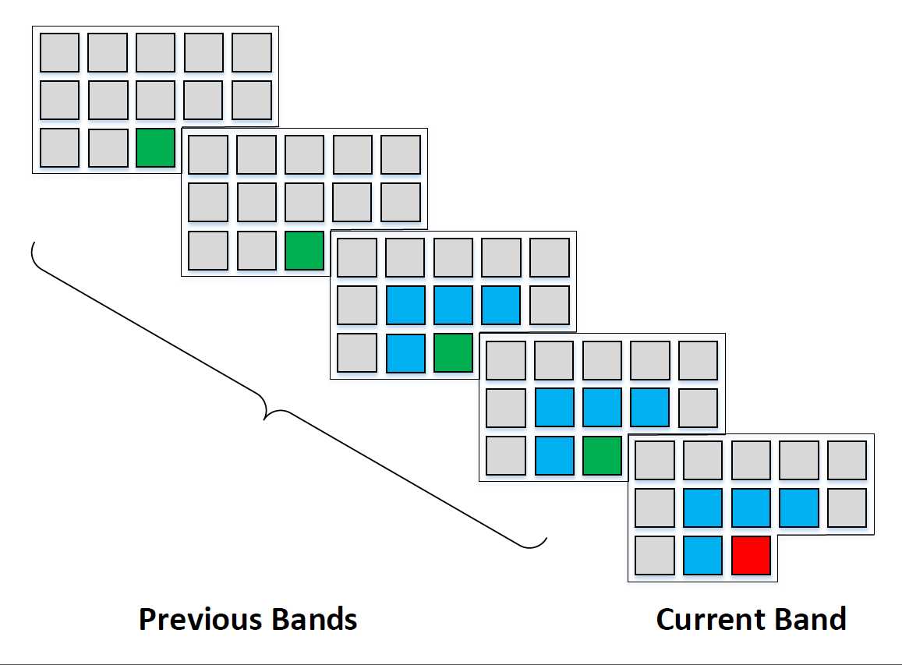
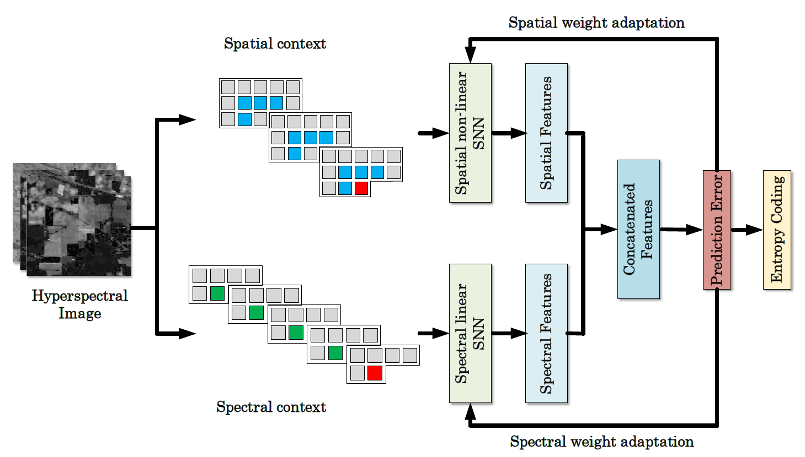

# imagecomCSNN
For more efficient lossless compression of hyperspectral image, we propose an adaptive prediction algorithm based on concatenated shallow neural networks (CSNN). The neural networks are capable of extracting both spatial andspectral correlations for accurate pixel value prediction. Unlike most of neural network based methods reported in literature, the proposed neural network serves as an adaptive filter and thus does not need to store decompressed data to pre-train the networks.

An example of context selection scheme for predicting the current pixel (in red), which consists of spatially neighboring pixels from the current band and two previous bands (in blue), as well as spectrally co-located pixels from the four previous bands (in green).

The CSNN was designed as an adaptive prediction filter rather than as a training-based network. Thus the model needs not be pre-trained before being used for pixel value calculation. The shallow two-hidden layer structure of the proposed model is capable of capturing both spatial and spectral correlations to provide more accurate pixel prediction, with only a few contexts from four previous bands.

load_hyperdata.py:

Pre-processing the hyperspectral data, selecting the context and forming the input data.

pytorch_concate.py:

Employing concatenated Shallow Neural Network for hyperspectral image predicitve filtering. 

